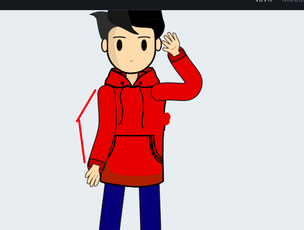
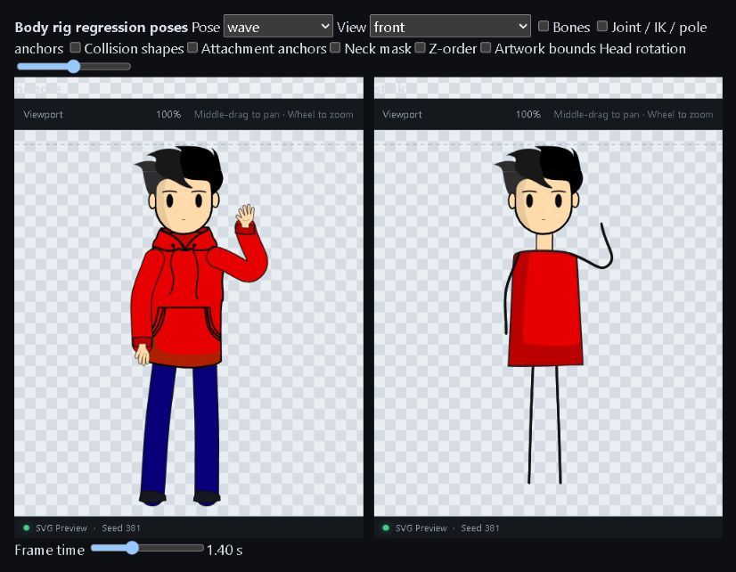
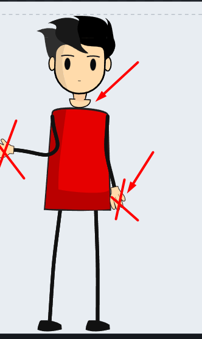
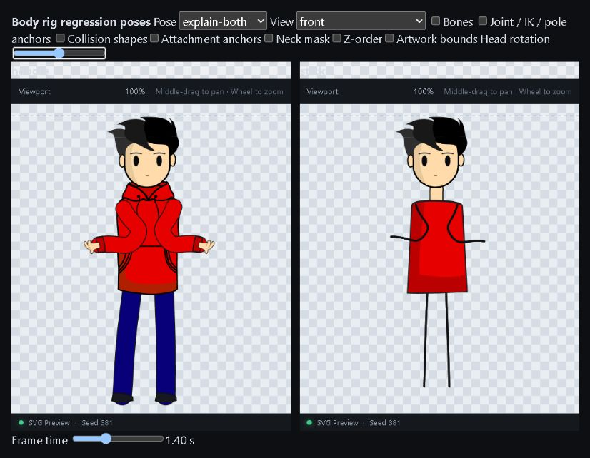
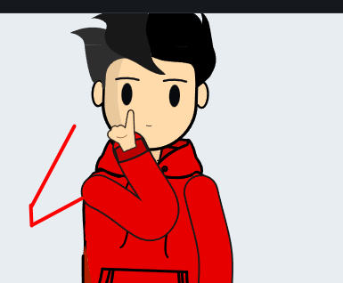
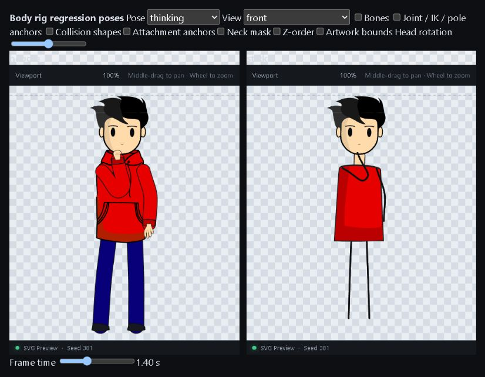
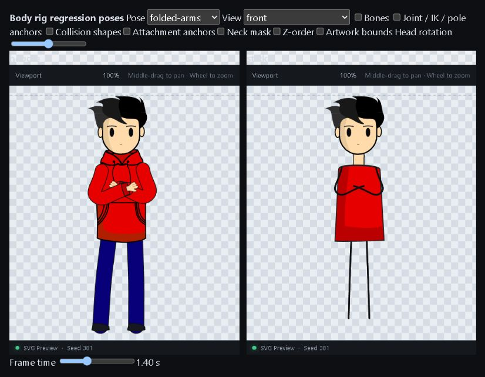
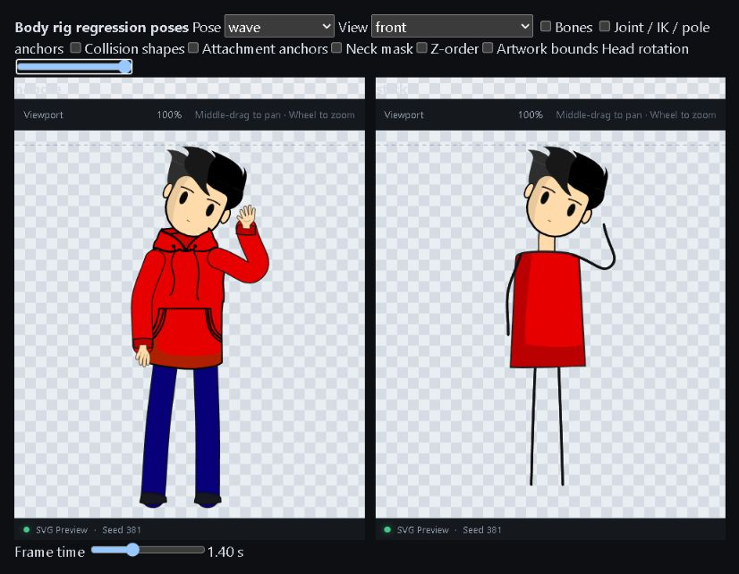

# Rig visual validation

Before images were supplied by the user. After images were captured from `/rig/body-qa` using the shared production viewport.










## Reproduce regression captures

Start `pnpm dev`. In PowerShell:

```powershell
$env:BODY_QA='1'
node scripts/body-render-smoke.mjs
node scripts/rig-visual-regression.mjs
```

The render script uses Remotion to export 720 frames per character. The comparison samples 18 frames per skin across six clips. Baselines live in `tests/visual/body`. Inspect differences before using `--update`; baselines are exact for the pinned renderer/FFmpeg setup and may need review after platform/font/codec changes. Ordinary `pnpm test` does not start a browser or perform these export regressions.
